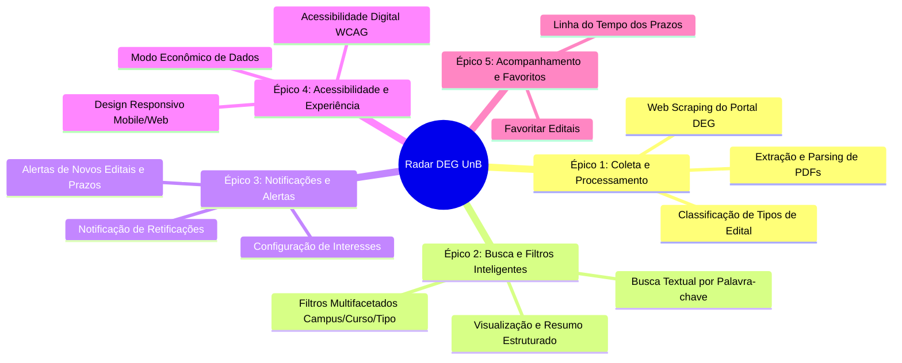

# Backlog do Produto: Radar de Editais DEG UnB

Este documento apresenta o **Backlog do Produto** para o sistema de busca, análise, filtragem e notificação de editais do Decanato de Ensino de Graduação da Universidade de Brasília (DEG UnB).

---

## 1. Visão do Produto

> **Para** a comunidade discente da UnB (em especial cotistas, graduandos e alunos buscando oportunidades ou transferência),  
> **Que** sofrem com a dispersão de editais em PDFs longos, perda de prazos e dificuldade de encontrar vagas relevantes para seu curso e campus,  
> **O Radar de Editais DEG** é uma plataforma centralizada e acessível (web/mobile)  
> **Que** coleta automaticamente os editais do DEG, extrai seus prazos, vagas e tipos (PIBIC, extensão, monitoria, bolsas), filtra por campus/curso e notifica os usuários sobre oportunidades de seu interesse,  
> **Diferente** da navegação manual pelo portal institucional do DEG e murais físicos,  
> **Nosso produto** oferece alertas proativos, leitura simplificada e busca focada no perfil de cada estudante.

---

## 2. Estrutura de Épicos e Features

---

## 3. Detalhamento dos Épicos e Histórias de Usuário (US)

---

### Épico 01 [EP01] - Coleta e Processamento Inteligente de Editais
**Objetivo:** Automatizar a captura contínua das publicações no portal do DEG e processar seus conteúdos (PDFs e páginas web) transformando dados não estruturados em informações organizadas e consultáveis.

#### [US01] - Coleta Automatizada de Editais do Portal DEG
* **Prioridade:** Must Have
* **Persona:** Todas as personas (Lucas, Mariana, Rafael)
* **Descrição:**  
  > **Como** sistema / estudante,  
  > **Eu quero** que a plataforma rastreie periodicamente o site do DEG UnB em busca de novos editais e anexos publicados,  
  > **Para que** as informações da plataforma estejam sempre atualizadas sem necessidade de cadastro manual.

* **Critérios de Aceitação:**
  - [ ] O *crawler/scraper* deve verificar o portal do DEG periodicamente (ex: a cada 6 ou 12 horas).
  - [ ] O sistema deve identificar novas publicações, minutas, editais completos, anexos e retificações.
  - [ ] Cada publicação coletada deve armazenar: título oficial, data de publicação, link para o documento original (PDF) e identificador único.
  - [ ] Falhas temporárias de conexão com o site do DEG não devem derrubar o serviço.

---

#### [US02] - Extração de Metadados e Prazos dos Editais (Parsing)
* **Prioridade:** Must Have
* **Persona:** Lucas Alves e Mariana Silveira
* **Descrição:**  
  > **Como** estudante com pouco tempo livre,  
  > **Eu quero** que o sistema identifique automaticamente nos editais as datas limites de inscrição, número de vagas e cursos contemplados,  
  > **Para que** eu não precise ler um documento extenso de dezenas de páginas só para saber prazos e elegibilidade.

* **Critérios de Aceitação:**
  - [ ] O sistema deve extrair do texto do edital: período de inscrições, data do resultado preliminar e final.
  - [ ] Deve identificar o quantitativo de vagas (remuneradas e/ou voluntárias) quando informado no edital.
  - [ ] Deve identificar o campus mencionado (Darcy Ribeiro, FGA, FCE, FUP ou Geral).
  - [ ] Se a extração automática falhar em algum campo, o documento deve ser marcado com status "parcialmente processado" mantendo o link do PDF acessível.

---

#### [US03] - Classificação Automática do Tipo de Oportunidade
* **Prioridade:** Must Have
* **Persona:** Mariana Silveira e Rafael Mendes
* **Descrição:**  
  > **Como** estudante procurando oportunidades acadêmicas específicas,  
  > **Eu quero** que os editais sejam categorizados por tipo (PIBIC, Monitoria, Extensão, Bolsas/Auxílios, Mudança de Curso/Transferência),  
  > **Para que** eu encontre diretamente as categorias relevantes para minha trajetória universitária.

* **Critérios de Aceitação:**
  - [ ] Cada edital deve ser rotulado com uma ou mais tags temáticas: `Monitoria`, `PIBIC / Iniciação Científica`, `Extensão`, `Bolsas / Auxílios`, `Mudança de Curso / Vagas Ociosas`, `Estágio / Outros`.
  - [ ] A categorização deve ser baseada em regras de palavras-chave e cabeçalhos do documento.
  - [ ] O usuário deve visualizar as tags coloridas de forma destacada no card do edital.

---

### Épico 02 [EP02] - Busca, Filtros e Visualização de Editais
**Objetivo:** Permitir que o estudante pesquise, refine e encontre com rapidez as oportunidades certas para seu campus, curso e perfil.

#### [US04] - Busca Textual por Palavra-Chave
* **Prioridade:** Must Have
* **Persona:** Mariana Silveira e Lucas Alves
* **Descrição:**  
  > **Como** estudante graduando,  
  > **Eu quero** pesquisar editais por termos específicos (como "biologia", "cálculo", "alimentação", "software"),  
  > **Para que** eu localize instantaneamente editais que mencionem as disciplinas ou temas do meu interesse.

* **Critérios de Aceitação:**
  - [ ] Barra de busca com resposta rápida (busca textual no título e corpo do edital).
  - [ ] Suporte a busca tolerante a acentuação e maiúsculas/minúsculas.
  - [ ] Exibição de mensagem amigável caso nenhum resultado seja encontrado, com sugestão de limpeza de termos.

---

#### [US05] - Filtragem Multifacetada (Campus, Tipo, Curso e Prazos)
* **Prioridade:** Must Have
* **Persona:** Lucas Alves, Mariana Silveira e Rafael Mendes
* **Descrição:**  
  > **Como** estudante de um campus ou curso específico,  
  > **Eu quero** filtrar os editais combinando critérios de campus, modalidade (bolsa/monitoria/pibic), curso e status de inscrição,  
  > **Para que** eu veja apenas as vagas para as quais sou elegível e que ainda estejam no prazo.

* **Critérios de Aceitação:**
  - [ ] Filtro por **Campus:** Campus Darcy Ribeiro (Plano Piloto), FGA (Gama), FCE (Ceilândia), FUP (Planaltina), Todos.
  - [ ] Filtro por **Tipo de Edital:** Monitoria (Remunerada / Voluntária), PIBIC, Extensão, Bolsas e Auxílios, Mudança de Curso / Transferência.
  - [ ] Filtro por **Status / Prazo:** Inscrições Abertas, Em Breve, Encerradas.
  - [ ] Filtro por **Curso:** Seleção de cursos de graduação da UnB.
  - [ ] Os filtros podem ser combinados livremente e limpos com um único clique.

---

#### [US06] - Visualização de Card Resumo e Cronograma do Edital
* **Prioridade:** Must Have
* **Persona:** Lucas Alves e Rafael Mendes
* **Descrição:**  
  > **Como** estudante acessando pelo smartphone,  
  > **Eu quero** ver um card resumido do edital com cronograma visual dos prazos e botão para baixar o PDF original,  
  > **Para que** eu compreenda as datas cruciais sem precisar gastar franquia de internet baixando arquivos pesados.

* **Critérios de Aceitação:**
  - [ ] O card deve apresentar de forma limpa: Título simplificado, Tipo, Campus, Período de Inscrição, Valor da Bolsa (se aplicável), e Dias Restantes para o encerramento.
  - [ ] Deve conter uma linha do tempo das etapas (Inscrição -> Homologação -> Resultado).
  - [ ] Link direto e seguro para o PDF oficial no servidor da UnB.

---

### Épico 03 [EP03] - Notificações e Alertas Personalizados
**Objetivo:** Manter os estudantes informados ativamente sobre novos editais, proximidade do fim dos prazos e retificações que impactem seus planos.

#### [US07] - Configuração de Preferências de Interesse
* **Prioridade:** Should Have
* **Persona:** Lucas Alves e Mariana Silveira
* **Descrição:**  
  > **Como** estudante com interesses acadêmicos bem definidos,  
  > **Eu quero** cadastrar minhas preferências (meu campus, meu curso e tipos de editais desejados),  
  > **Para que** o sistema filtre previamente as oportunidades mais relevantes para mim.

* **Critérios de Aceitação:**
  - [ ] Tela simples de preferências onde o usuário marca seu campus, curso e áreas de interesse (ex: "Bolsas", "Monitoria").
  - [ ] Possibilidade de editar ou desativar as preferências a qualquer momento.

---

#### [US08] - Notificação de Novos Editais e Prazos a Vencer
* **Prioridade:** Should Have
* **Persona:** Lucas Alves e Rafael Mendes
* **Descrição:**  
  > **Como** estudante atarefado com rotina pesada,  
  > **Eu quero** receber notificações quando um edital do meu perfil for lançado ou quando faltarem 48h para o fim das inscrições,  
  > **Para que** eu nunca mais perca a chance de concorrer a uma bolsa ou vaga por esquecimento.

* **Critérios de Aceitação:**
  - [ ] Envio de alerta instantâneo quando um edital correspondente aos filtros de interesse do usuário for publicado.
  - [ ] Envio de lembrete preventivo (ex: 48h e 24h antes do encerramento da inscrição) para editais favoritados.
  - [ ] O usuário pode optar por receber notificações no navegador/app (Push) ou via E-mail.

---

#### [US09] - Alerta Crítico de Retificação de Edital
* **Prioridade:** Should Have
* **Persona:** Rafael Mendes (Troca de curso) e Lucas Alves
* **Descrição:**  
  > **Como** estudante inscrito em um processo seletivo concorrido (como mudança de curso ou auxílio),  
  > **Eu quero** ser notificado imediatamente se o edital sofrer uma retificação ou prorrogação de prazo,  
  > **Para que** eu não seja prejudicado por mudanças inesperadas no cronograma oficial.

* **Critérios de Aceitação:**
  - [ ] O sistema deve rastrear alterações e documentos complementares vinculados ao edital pai.
  - [ ] Ao detectar retificação, enviar alerta com destaque visual: "ATENÇÃO: Este edital foi retificado em [Data]".
  - [ ] Exibir comparação sumária do que foi alterado quando disponível.

---

### Épico 04 [EP04] - Acessibilidade, Inclusão e Experiência do Usuário
**Objetivo:** Assegurar que a plataforma seja plenamente utilizável por qualquer membro da comunidade universitária, em qualquer dispositivo ou condição de conectividade.

#### [US10] - Acessibilidade Digital e Suporte a Leitores de Tela (WCAG)
* **Prioridade:** Must Have
* **Persona:** Todas as personas, em especial estudantes com deficiência visual ou motora
* **Descrição:**  
  > **Como** estudante com baixa visão ou deficiência visual que utiliza leitores de tela,  
  > **Eu quero** navegar por toda a plataforma, filtros e conteúdos de editais de maneira estruturada e sem barreiras,  
  > **Para que** eu tenha igualdade de acesso às oportunidades públicas da UnB.

* **Critérios de Aceitação:**
  - [ ] Conformidade com as diretrizes WCAG 2.1 nível AA.
  - [ ] Todos os botões, links, cards e campos de filtro devem conter rótulos descritivos (`aria-label`, contraste adequado).
  - [ ] Suporte a navegação completa por teclado (Tab, Enter, Espaço).
  - [ ] Disponibilização de botão de Alto Contraste e ajuste do tamanho da fonte.

---

#### [US11] - Modo Econômico de Dados e Responsividade Móvel
* **Prioridade:** Should Have
* **Persona:** Lucas Alves (Cotista com dados móveis restritos)
* **Descrição:**  
  > **Como** estudante que utiliza internet 3G/4G no trajeto de ônibus,  
  > **Eu quero** uma interface leve, rápida de carregar e totalmente adaptada à tela do celular,  
  > **Para que** meu plano de dados não se esgote ao consultar oportunidades.

* **Critérios de Aceitação:**
  - [ ] Layout 100% responsivo (otimizado para telas pequenas de 360px até desktops).
  - [ ] Carregamento inicial da página inferior a 2 segundos em rede 3G/4G.
  - [ ] Não fazer download de arquivos PDF volumosos de forma automática; apenas sob demanda explícita do usuário.

---

### Épico 05 [EP05] - Acompanhamento e Gestão de Editais Favoritos
**Objetivo:** Facilitar a gestão pessoal das oportunidades em que o estudante tem interesse.

#### [US12] - Favoritar e Acompanhar Editais
* **Prioridade:** Could Have
* **Persona:** Mariana Silveira e Rafael Mendes
* **Descrição:**  
  > **Como** estudante organizando minhas candidaturas do semestre,  
  > **Eu quero** marcar editais como "Favoritos" em uma lista pessoal,  
  > **Para que** eu possa acompanhar facilmente apenas os processos seletivos nos quais pretendo me inscrever.

* **Critérios de Aceitação:**
  - [ ] Botão de "Favoritar" (ícone de estrela/coração) em cada card de edital.
  - [ ] Aba dedicada "Meus Editais Salvos" na interface principal.
  - [ ] Indicador visual se o edital salvo já teve o resultado preliminar/final divulgado.

---

## 4. Matriz de Priorização do Backlog (MoSCoW)

| ID | História de Usuário (US) | Épico | Prioridade | Complexidade Estimada |
| :---: | :--- | :---: | :---: | :---: |
| **US01** | Coleta automatizada de editais do portal DEG (Scraper) | EP01 | **Must Have** | Alta |
| **US02** | Extração de metadados, prazos e vagas dos editais | EP01 | **Must Have** | Muito Alta |
| **US03** | Classificação automática do tipo de oportunidade | EP01 | **Must Have** | Média |
| **US04** | Busca textual por palavra-chave | EP02 | **Must Have** | Média |
| **US05** | Filtragem multifacetada (Campus, Tipo, Curso, Prazos) | EP02 | **Must Have** | Média |
| **US06** | Visualização de card resumo e cronograma do edital | EP02 | **Must Have** | Baixa |
| **US10** | Acessibilidade digital e suporte a leitores de tela | EP04 | **Must Have** | Média |
| **US07** | Configuração de preferências e perfil de interesse | EP03 | **Should Have** | Média |
| **US08** | Notificação de novos editais e lembrete de prazos | EP03 | **Should Have** | Alta |
| **US09** | Alerta de retificação e mudanças de cronograma | EP03 | **Should Have** | Média |
| **US11** | Modo econômico de dados móveis e responsividade | EP04 | **Should Have** | Baixa |
| **US12** | Favoritar editais e acompanhar inscrições | EP05 | **Could Have** | Baixa |

---

## 5. Rastreabilidade: Personas vs. Histórias do Backlog

| Persona | Histórias de Usuário Relacionadas | Necessidade Atendida |
| :--- | :--- | :--- |
| **Lucas Alves** (Cotista) | US01, US02, US03, US05, US06, US08, US10, US11 | Acesso rápido a bolsas/auxílios, alertas de prazos apertados, economia de dados e total acessibilidade. |
| **Mariana Silveira** (Graduanda) | US01, US03, US04, US05, US06, US07, US08, US12 | Filtros por curso/campus Darcy, busca por monitoria e PIBIC, favoritos e acompanhamento do resultado. |
| **Rafael Mendes** (Troca de Curso) | US01, US02, US03, US05, US06, US08, US09, US12 | Destaque para vagas ociosas/mudança de curso, aviso imediato de retificações e extração do quadro de vagas. |

---

## Histórico de Revisões

| Data | Versão | Descrição | Autor |
| :---: | :---: | :--- | :--- |
| 10/09/2026 | 1.0 | Elaboração do Backlog do Produto completo com Épicos, USs e Matriz MoSCoW | Grupo 4 |
